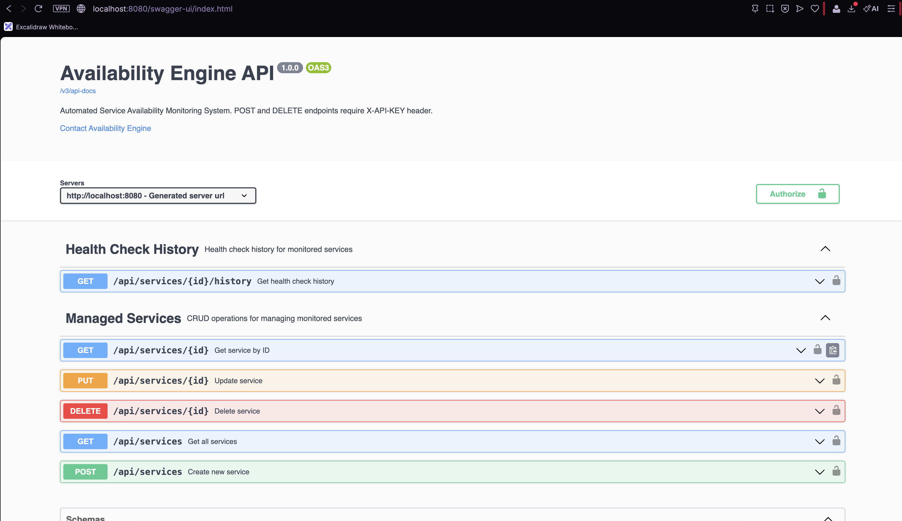
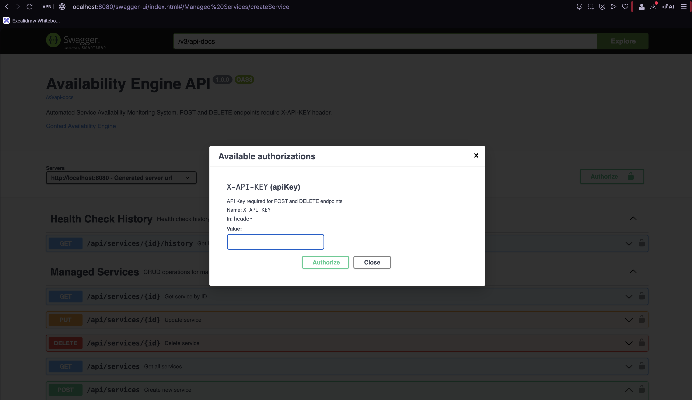
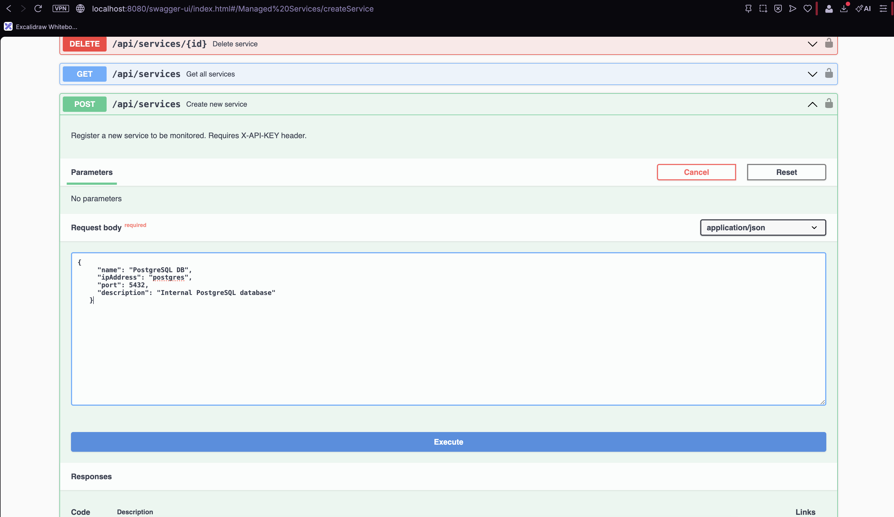
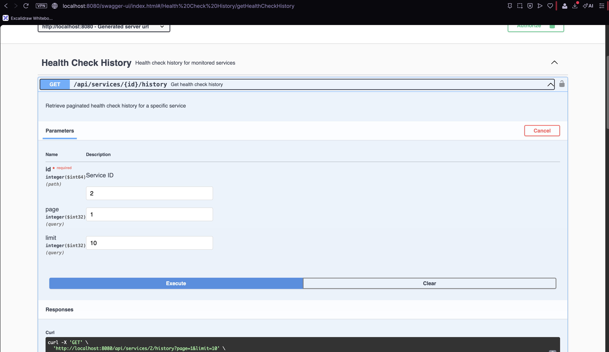
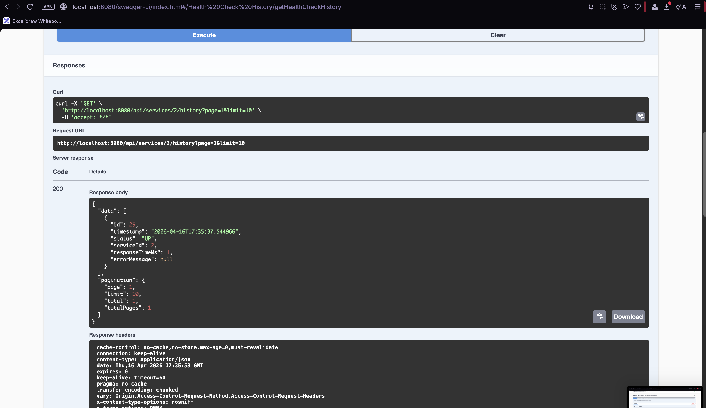
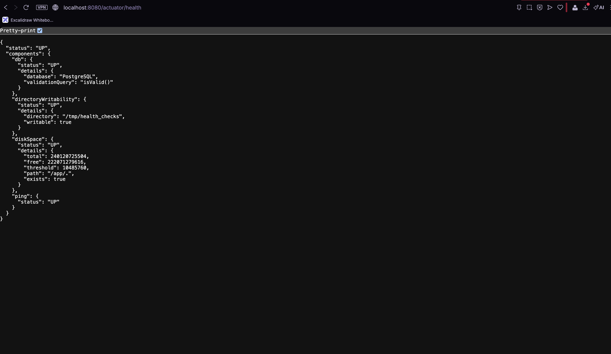
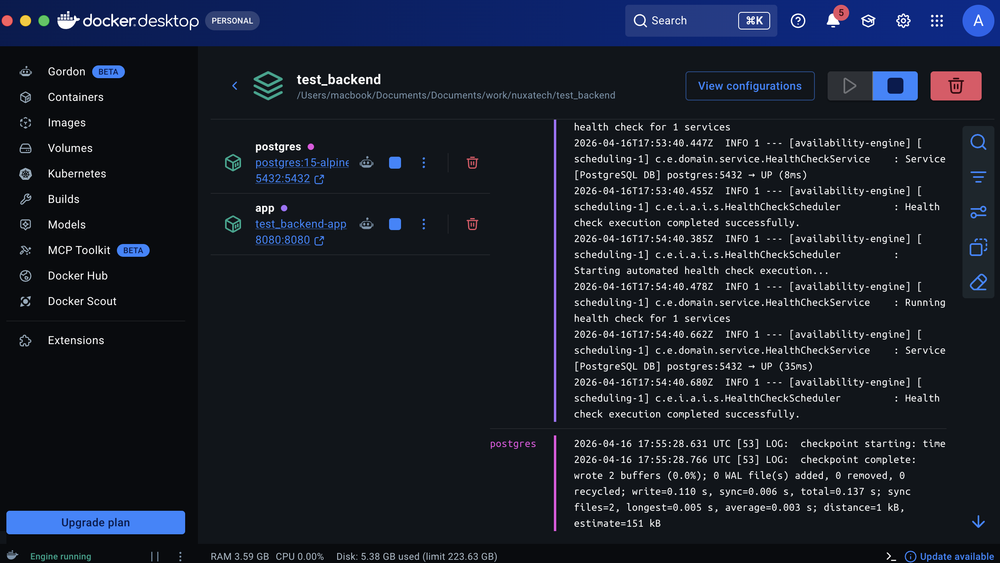

# README

# Availability Engine

Sistem monitoring otomatis untuk memantau ketersediaan (availability) layanan internal maupun eksternal secara real-time.

---

## Setup Guide

### Prasyarat

- Docker & Docker Compose terinstall
- Port `8080` dan `5432` tidak sedang digunakan

### Langkah Menjalankan Project

**1. Clone repository**

```bash
git clone <url-repository>
cd availability-engine
```

**2. Salin file environment**

```bash
cp .env.example .env
```

**3. Jalankan dengan Docker Compose**

```bash
docker compose up --build -d
```

**4. Cek status container**

```bash
docker compose ps
```

Pastikan kedua container `availability-postgres` dan `availability-engine` berstatus `healthy`.

**5. Akses aplikasi**

| URL                                     | Keterangan                             |
| --------------------------------------- | -------------------------------------- |
| `http://localhost:8080/swagger-ui.html` | Swagger UI — dokumentasi & testing API |
| `http://localhost:8080/actuator/health` | Health check endpoint                  |
| `http://localhost:8080/api/services`    | API utama                              |

---

### Konfigurasi Environment

Semua konfigurasi ada di file `.env`. Yang penting untuk diperhatikan:

```
APP_SECURITY_API_KEY=test-api-key-12345   # API Key untuk endpoint POST & DELETE
APP_SCHEDULER_INTERVAL_SECONDS=60         # Interval health check (detik)
APP_SCHEDULER_TIMEOUT_SECONDS=5           # Timeout koneksi TCP (detik)
```

### Menghentikan Aplikasi

```bash
# Hentikan tanpa hapus data
docker compose down

# Hentikan dan hapus semua data (termasuk database)
docker compose down -v
```

---

## Arsitektur & Keputusan Teknis

### Mengapa Hexagonal Architecture?

Project ini menggunakan **Hexagonal Architecture (Ports & Adapters)** dengan alasan:

- **Isolasi domain** — Business logic di `domain/` tidak bergantung pada framework atau database. Mudah diubah tanpa efek samping.
- **Testability** — Setiap layer bisa di-test secara independen karena komunikasi antar layer menggunakan interface (port).
- **Fleksibilitas** — Implementasi infrastruktur (database, scheduler, REST) bisa diganti tanpa mengubah domain logic.

### Struktur Layer

```
src/main/java/com/engine/
├── domain/
│   ├── model/          → Entity JPA (ManagedService, HealthCheckHistory)
│   ├── service/        → Business logic (ManageService, HealthCheckService)
│   └── exception/      → Custom exception
├── aplication/
│   └── port/
│       ├── input/      → Kontrak use case (ManageServiceUseCase, HealthCheckUseCase)
│       └── output/     → Kontrak repository (ManageServiceRepositoryPort, HealthCheckRepositoryPort)
└── infrastructure/
    ├── adapter/
    │   ├── input/
    │   │   ├── rest/       → REST Controller + DTO
    │   │   └── scheduler/  → @Scheduled health check
    │   └── output/
    │       └── presistence/ → JPA Repository + Persistence Adapter
    └── config/             → Security, Swagger, Actuator custom indicator
```

### Bagaimana Kompleksitas Ditangani

**1. Health Check Otomatis**
Scheduler berjalan setiap 60 detik menggunakan `@Scheduled`. Setiap service di-ping via TCP Socket ke IP:port yang terdaftar. Pendekatan TCP dipilih karena lebih akurat dibanding ICMP ping — langsung mengecek apakah port service tersebut benar-benar bisa dikoneksi.

**2. Efisiensi Penyimpanan History**
History hanya disimpan ketika:

- Status `DOWN` → selalu disimpan untuk audit trail
- Status `UP` → disimpan maksimal 1 kali per jam per service

Ini mencegah database bengkak akibat record `UP` yang berulang setiap menit.

**3. Keamanan API**
Menggunakan API Key authentication via header `X-API-KEY`. Hanya endpoint `POST` dan `DELETE` yang dilindungi — sesuai requirement untuk “demonstrate security awareness” tanpa over-engineering dengan JWT.

**4. Circular Reference Prevention**
Repository layer dipisah menjadi dua:

- `ManageServiceRepository` — JPA interface murni
- `ManageServicePersistenceAdapter` — implementasi port, jembatan antara domain dan JPA

Ini mencegah circular dependency yang terjadi ketika satu interface mengextend dua interface dengan method yang sama.

**5. Pagination**
Semua endpoint list (`GET /api/services`, `GET /api/services/{id}/history`) menggunakan pagination untuk mencegah query berat saat data sudah banyak.

---

## API Endpoints

### Managed Services

| Method | Endpoint             | Auth      | Keterangan                     |
| ------ | -------------------- | --------- | ------------------------------ |
| GET    | `/api/services`      | -         | List semua service (paginated) |
| GET    | `/api/services/{id}` | -         | Detail service by ID           |
| POST   | `/api/services`      | X-API-KEY | Tambah service baru            |
| PUT    | `/api/services/{id}` | -         | Update service                 |
| DELETE | `/api/services/{id}` | X-API-KEY | Hapus service                  |

### Health Check History

| Method | Endpoint                     | Auth | Keterangan                       |
| ------ | ---------------------------- | ---- | -------------------------------- |
| GET    | `/api/services/{id}/history` | -    | Riwayat health check (paginated) |

### Observability

| Method | Endpoint            | Keterangan                               |
| ------ | ------------------- | ---------------------------------------- |
| GET    | `/actuator/health`  | Status aplikasi + custom directory check |
| GET    | `/actuator/metrics` | Metrics aplikasi                         |

---

## Contoh Penggunaan

**Tambah service baru:**

```bash
curl -X POST http://localhost:8080/api/services \
  -H "X-API-KEY: test-api-key-12345" \
  -H "Content-Type: application/json" \
  -d '{
    "name": "PostgreSQL DB",
    "ipAddress": "postgres",
    "port": 5432,
    "description": "Internal database server"
  }'
```

**Lihat semua service:**

```bash
curl http://localhost:8080/api/services?page=1&limit=10
```

**Lihat history health check:**

```bash
curl http://localhost:8080/api/services/1/history?page=1&limit=10
```

---

## Evidence / Screenshot

1. Swagger UI — daftar endpoint

   

2. Memasukan Autorization X-API-KEY yang terdaftar di env

   

3. POST service baru via Swagger

   

4. GET all history dengan response pagination

   

   

5. Actuator health endpoint dengan custom directory indicator

   

6. Log scheduler health check berjalan

   

---

## Tech Stack

| Teknologi         | Versi | Fungsi                 |
| ----------------- | ----- | ---------------------- |
| Java              | 17    | Bahasa pemrograman     |
| Spring Boot       | 3.2.0 | Framework utama        |
| Spring Data JPA   | -     | ORM & repository       |
| Spring Security   | -     | API Key authentication |
| Spring Actuator   | -     | Observability          |
| PostgreSQL        | 15    | Database               |
| Springdoc OpenAPI | 2.0.2 | Swagger UI             |
| Lombok            | -     | Boilerplate reduction  |
| Docker & Compose  | -     | Containerization       |
